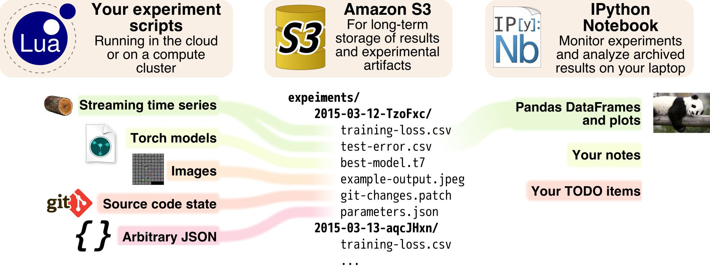

Lab Workbook
============

An organized workflow for your Torch machine learning experiments.



If you have many experiments to run, it can be hard to keep track of
them. This library solves three problems:

- **Capturing experimental artifacts** like loss functions, Torch
  models, time series, etc. from your Torch experiments to a permanent
  location (Amazon S3);
- **Helping you analyze results** by making each artifact readily
  available for exploration from an IPython Notebook running on your
  laptop
- **Helping you plan which experiments to run** by keeping each
  experiment separate, immutable, and easily referable.

This library comes in two parts:

- **Lua code for your training scripts** that saves experimental
  artifacts to S3.
- **Python code for your development laptop** that loads those
  artifacts from S3 so you can analyze results from an IPython
  Notebook

How to set up
=============
**On your training server:**

- **Install Torch.**
- **Set up and configure the AWS Command Line tools**, which is the
  `awscli` PyPI Python package. The `aws` command should be in your
  `$PATH`. You can use `aws configure` to enter your IAM credentials.
  At this point, running `aws list` in the shell should show you a
  list of your S3 buckets. (This library will call the `aws` binary)
- **Install the Lua workbook** using Luarocks. At the time of writing,
  this package is not available on the Rocks server, so you must
  install it from github manually.
```
    git clone https://github.com/gcr/lab-workbook lab-workbook
    cd lab-workbook
    luarocks make
```
- **Configure the workbook** by creating `~/.lab-workbook-config` with
  the following contents:
```
    bucketPrefix = s3://your-bucket/experiments/
```
  where `your-bucket` is the name of your S3 bucket and `experiments/`
  is the S3 prefix to save all experiments to. Be sure this path ends
  with `/` if you want to save experiments within this folder!


**On your development laptop:**

- **Install boto and pandas**. [Configure Boto](http://boto.cloudhackers.com/en/latest/getting_started.html#configuring-boto-credentials) so you can use AWS.
- **Install the Python workbook**. At the time of writing, this
  package is not available on PyPI, so you must install it yourself:
```
    git clone https://github.com/gcr/lab-workbook lab-workbook
    cd lab-workbook
    pip install .
```
- **Configure the workbook** by creating `~/.lab-workbook-config` with
  the same contents as on your experiment server (see above).

You're now ready to run.

Using the lab workbook
======================

**In the training scripts:** Here is a template to use. This is
Lua/Torch code. It does not work, but it does illustrate the flavor.
Adapt as you see fit:

```lua
require 'torch'
require 'nn'
require 'cunn'

-------- Create a new experiment
local workbook = require('lab-workbook'):newExperiment{}
-- That will print an "Experiment Tag" to stdout.
-- Be sure to write down that tag for later!

-------- Save the parameters and current changes to the source code
workbook:saveGitStatus()
workbook:saveJSON("parameters",
                  {
                    learningRate = 0.001,
                    momentum      = 0.9,
                    etc           = "your stuff here",
                  })


-------- Create time series logs
local lossLog = workbook:newTimeSeriesLog("Training loss",
                                          {"epoch", "loss", "gradientNorm"},
                                          100)
-- A time series that logs the current epoch, the current loss value,
-- and the gradient norm. The series is saved to S3 every 100 entries.

local errorLog = workbook:newTimeSeriesLog("Testing Error",
                                           {"epoch", "error"})
-- A time series that logs the current testing error after every epoch.


-------- Begin training
while true do
    for batch in dataset:getEpochBatches() do
       ...
       loss = optim.sgd(...)
       -------- Save entry into loss log
       lossLog{epoch = epoch + nImagesSeen/dataset:size(),
               loss = loss,
               gradientNorm = model.gradWeights:norm(),
               }
    end
    ...
    -------- Save entry into testing error log
    errorLog{epoch = epoch_count,
             error = trainer:evaluate(model)}
    -------- Upload Torch model to S3
    workbook:saveTorch("model", model)
    workbook:saveTorch("sgdState", sgdState)
end

```

The key ingredients are:

- Create a new experiment by calling `workbook = require('lab-workbook'):newExperiment{}`
- Save artifacts by calling the `workbook:saveXXXX(...)` functions
- Create time series logs by calling `log = workbook:newTimeSeriesLog(...)`. Then, write to the log file with `log{...}`

These three ingredients are all you need from the training side. It's
easy to add workbook functionality to your existing old training
scripts.

Working with Experiments
------------------------

Each **experiment** is a **collection of artifacts.** Experiments
carry a **unique tag**, which is a random string generated for each
training run.

- **Each invocation of your training script will make its own
  Experiment.** After your training script exits, that Experiment
  should not be modified.

- **Each Experiment is stored in a separate folder (prefix) to S3**,
  making it easy to list them with conventional S3 bucket tools.

- **Each Experiment is uniquely identified by its tag.** If you save
  Git Code artifacts and Parameter JSON artifacts to this experiment,
  that tag is all you need to uniquely and completely specify the
  entire state of your running session. This is a good idea because it
  helps you answer "What was I doing six months ago" without any fuss!


**In the training scripts:** From the Torch side, create a new
experiment by calling `require('lab-workbook'):newExperiment{}` The
resulting workbook object is tied to a single experiment.

Workbooks have a `tag` property that you can use to retrieve the
experiment tag. This tag is also printed to stdout. Every time you run
your training script, you should write that experiment tag somewhere!


**On the development laptop:**

The following Python code shows how to load experiments and artifacts.
(spoiler: it's all just `[]`-indexing)

```python
import lab_workbook
wb = lab_workbook.ExperimentRepository()

# Print a list of experiments (Note: It's better to just write the tag
# in your lab notes each time you start off a new training instance)
print wb[:]
#=> [<Experiment: 201601201654-OApx8tj3ZU>,
#    <Experiment: 201602122146-ZN6z9mEs3B>,
#    <Experiment: 201602122149-PMJ8a76csB>,
#    ...
#   ]


# Fetch a single experiment by indexing its tag.
experiment = wb['201602122149-PMJ8a76csB']

# Print all artifacts inside the experiment.
print experiment.list_artifacts()
#=> ['Source.git-current-commit',
#    'Source.git-patch',
#    'Training loss.csv',
#    'options.json']

# Fetch a certain artifact by indexing the experiment object.
# The result is loaded as a suitable object type (for instance, CSV
# files become Pandas DataFrame objects; JSON objects like this one
# become actual Python dictionaries...)
print wb['201602122149-PMJ8a76csB']['options.json']
#=>  {'opt': {'LR': 0.1,
#     'backend': 'cudnn',
#     'batchSize': 50,
#     'data': '/mnt/data/',
#     'momentum': 0.9,
#     'weightDecay': 0.0001}}
```

JSON Artifacts
--------------

JSON artifacts are saved to S3 with a `.json` file extension. You can
save any value that the Lua `cjson` library can encode. (Note that
Torch tensors cannot be saved as JSON).

**In the training scripts:**
`LabWorkbook:saveJSON(artifactName, value)` will immediately encode
`value` into a JSON object and asynchronously upload the result to S3
with a name of `artifactName.json`. If there is an error, it will be
asynchronously printed to stderr.

**On the development laptop:**
`ExperimentRepository()['experiment-tag']['artifact.json']` will load
`artifact` from S3 as a Python dictionary.


Torch Model Artifacts
---------------------

You can save Torch models directly into S3. (Note: Do not upload large
models very often or you will run up your S3 bandwidth fees! I learned
this the hard way. *Misuse of this function can cost you $100s per
month.*)

**In the training scripts:** `LabWorkbook:saveTorch(artifactName,
value)` will immediately use `torch.save` to write `value` into a
temporary file. This file is asynchronously uploaded to S3 with a name
of `artifactName.t7` and then removed. If there is an error, it will
be asynchronously printed to stderr.

**On the development laptop:** There is no support for loading Torch
models into Python. At least it's on S3 when you need it...

Git Status Artifacts
--------------------
You can save the current state of your source code as an artifact.
This is handy if you quickly want to test simple changes without
bothering to commit them to your source repository.

**In the training scripts:** `LabWorkbook:saveGitStatus(artifactName)`
will save the output of `git log -n 1` into
`artifactName.git-current-commit`, and the output of `git diff HEAD`
into `artifactName.git-patch` Together, these two files show the
current commit and any changes you have made to your working tree.
Both files are uploaded asynchronously. Any problems will be
asynchronously printed to stderr.

**On the development laptop:** These artifacts will be returned as
strings. You can use the following snippet to colorify the patch:

```python
from pygments import lexers, formatters, highlight
# Print the current patch with ANSI colors
print highlight(experiment['source.git-patch'],
                lexers.DiffLexer(),
                formatters.TerminalFormatter())
```

This is helpful to quickly compare the code between several related
versions to double-check that it's doing what it's supposed to:

```python
from pygments import lexers, formatters, highlight
import collections
experiments = collections.OrderedDict([
    # Several related experiments
    ("201601141709-56THQt7", "Original paper: Nesterov, 1e-1"),
    ("201601151305-mCNmpoe", "RMSprop, 1e-2"),
    ("201601151301-44vqJzD", "Adadelta, rho = 0.3"),
    ("201601151737-AOCswyd", "Adagrad, 1e-2"),
])
# Glance at CHANGED code and parameters to make sure they're correct
for k,v in experiments.items():
    print "\n\n", ("#"*30), k,v
    print wb[k]['opt.json']
    print highlight(wb[k]["source.git-patch"], lexers.DiffLexer(), formatters.TerminalFormatter())
```


Time Series Artifacts
---------------------

The workbook can also hold rapidly-changing time series artifacts,
which are great for loss function logs, test-accuracy logs, and so on.

**In the training scripts:** The `ts =
LabWorkbook:newTimeSeriesLog(artifactName, fields, saveEvery)` call
creates a new Time Series Artifact, which will be asynchronously
uploaded into S3 as `artifactName.csv` *at most* every `saveEvery`
(default=1) entries. The time series will have the given `fields` (the
first field should be the dependent variable).

The result is a logging function backed by a temporary CSV file. To
add a new line to the CSV file, call the logger with a table
containing values to log.

Every time series automatically includes a `Date` field which will
contain the UTC time of each row.

Example:

```lua
local workbook = labWorkbook:newExperiment{}
local lossLog = workbook:newTimeSeriesLog("Training loss",
                                          {"nImages", "loss"},
                                          100)
local nImages = 0
while true do
    lossLog{ nImages = nImages,   loss = 0.234 }
    nImages = nImages + 1
end
```

**Caveat:** There is currently no way to flush a partially buffered
time series to S3. This means that if `saveEvery` is a high value, and
your script exits before filling them all, you may lose at most
`saveEvery-1` entries.

**Caveat:** The entire CSV file is re-uploaded to S3 every `saveEvery`
entries. This will eventually write O(n^2) bytes to S3. You may wish
to split long-running time series into multiple artifacts to avoid
this behavior.

**On the development laptop:** Time series artifacts are loaded into a
Pandas DataFrame. The first `field` is the index.

```python
print wb["201602122217-Alvz4j6z3B"]['Training.csv']
#=>                time  dataTime      loss  top1  top5                Date
#    epoch
#    0.000039  7.839578  2.494717  6.986132   100   100 2016-02-12 22:17:34
#    0.000078  0.945976  0.001641  7.147533   100   100 2016-02-12 22:17:35
#    0.000117  0.960760  0.000467  7.415804   100   100 2016-02-12 22:17:36
#    0.000156  0.962459  0.000441  7.275706   100   100 2016-02-12 22:17:37
#    0.000195  0.960628  0.000466  7.308182    98    98 2016-02-12 22:17:38
#    ...            ...       ...       ...   ...   ...                 ...
#    7.055846  0.958134  0.000471  3.325324    74    44 2016-02-14 23:11:00
#    7.055885  0.958352  0.000473  3.598765    74    48 2016-02-14 23:11:01
#    7.055924  0.835841  0.000674  3.635168    82    42 2016-02-14 23:11:02
#
#    [180801 rows x 6 columns]

# Use any Pandas functions to wrangle the data:
train = wb["201602122217-Alvz4j6z3B"]['Training.csv']
train.time.describe()
#=>  count    181001.000000
#    mean          0.957653
#    std           0.025014
#    min           0.593527
#    25%           0.957184
#    50%           0.957962
#    75%           0.959042
#    max           7.839578
#    Name: time, dtype: float64

# Plotting is super easy:
train.loss.plot()
```

```python
# This is Pandas, so it's also easy to plot multiple variables, smooth
# them out, etc...
pd.rolling_mean(train[['top1', 'top5']], 100).plot()
```


**Merging several related experiments**: Sometimes it's useful to plot
a single field (loss, accuracy, etc) across several related
experiments at once. The Python interface includes a handy function
for this. `ExperimentRepository.meld_csv({"experiment_tag": "column_name",...}, "artifact.csv", "field")`
will fetch `artifact.csv` from every `experiment_tag` and combine them
into a single Pandas DataFrame object. Each column of the result
corresponds to a single experiment. The values come from the `field`
column of each experiment's `artifact.csv`.

Example: Plot the `loss` from several related experiments over time:
```python
experiments = collections.OrderedDict([
("201601141709-AnY56THQt7", "Nsize=3 (ORIG PAPER), 20 layers"),
("201601141709-rewkex7oPJ", "Nsize=5, 32 layers"),
("201601141710-HxIw7lGPyu", "Nsize=7, 44 layers"),
("201601141710-te4ScgnYMA", "Nsize=9, 56 layers"),
("201601142006-5T5D1DO3VP", "Nsize=18, 110 layers"),
])
train_loss = wb.meld_csv(experiments, "Training loss.csv","loss")
pd.rolling_mean(train_loss, 100)
  .plot(title="Training loss (Rolling mean over 100 batches)",
        figsize=(20,5),
        xlim=(0,200),
        ylim=(0, 0.5),
        )
```

```python
print train_loss.head()
#=>           Nsize=3 (ORIG PAPER), 20 layers  Nsize=5, 32 layers  \
#    epoch
#    0.00000                         2.640196            2.775886
#    0.00256                         2.904888            4.451223
#    0.00512                         3.285033            5.523656
#    0.00768                         3.310323            8.113060
#    0.01024                         3.023435            5.673736
#
#             Nsize=7, 44 layers  Nsize=9, 56 layers  Nsize=18, 110 layers
#    epoch
#    0.00000            2.716562            3.950236              4.233791
#    0.00256            4.854539            9.493719              3.638155
#    0.00512            8.623064            9.278872              2.986166
#    0.00768           10.269727           11.068035              3.644975
#    0.01024           10.159962            9.376174              3.004177
